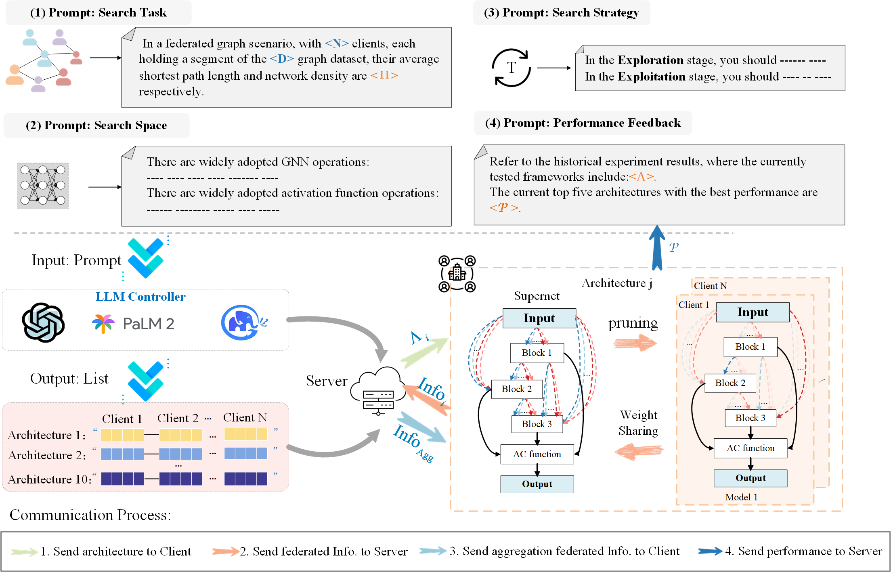
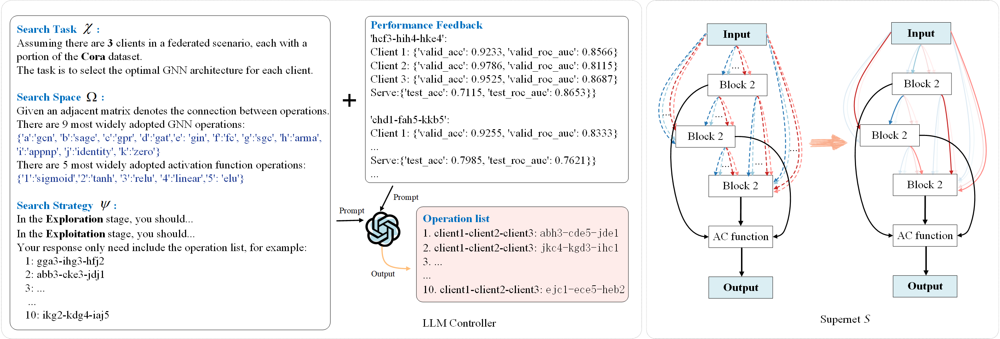

# PFGNAS

This repo contains the sample code for reproducing the results of our paper: Graph Neural Architecture Search with Large Language Models for Personalized Federated Learning.

## Introduction

​	Personalized federated learning on graphs is widely studied for collaboratively training a global model in the presence of heterogeneous graphs distributed among multiple clients while preserving data privacy. However, its reliance on expert knowledge for model design and its tendency to make simplistic assumptions about data distribution impose new challenges to federated learning on graphs. While Graph Neural Architecture Search (GNAS) has emerged as a solution for the automated design of Graph Neural Network (GNN) architectures, it falls short in effectively incorporating personalization information in federated learnings. 

To address this issue, we design an innovative approach termed \textbf{P}ersonalized \textbf{F}ederated \textbf{G}raph \textbf{N}eural \textbf{A}rchitecture \textbf{S}earch (PFGNAS). 

- Motivated by the reasoning capability and inherent adaptability of large language models (LLMs), we explore the probability of LLMs enhancing the efficiency of federated personalized architecture search. PFGNAS formulates a task-specific prompt to use the self-reflective capabilities of large language models, facilitating continuous exploration and discovery of optimal architectures. 

- Second, to address the issue of client drift arising from data heterogeneity, we adopt a weight-sharing supernet strategy to enhance the server model's optimization while preserving the client model's personalization. Extensive experiments show the superior performance of PFGNAS compared to conventional methods, particularly emphasizing the efficacy of large language models in Graph Neural Architecture Search (GNAS) tasks.




<div style="text-align: center; font-size: smaller; font-weight: bold;">


Figure 1. The overall framework of our PFGNAS


</div>





<div style="text-align: center; font-size: smaller; font-weight: bold;">


Figure 2. A simplified example of GNN NAS optimization is demonstrated using the Cora dataset


</div>

## Results

### The Performance of Different Clients numbers (under Cross-Nodes clients scenario)

**(Citeseer N=10)**

| Model       | ACC            | ROC            |
| ----------- | -------------- | -------------- |
| GCN         | 78.63±1.21     | 78.58±0.52     |
| GraphSage   | 74.15±0.54     | 73.20±0.29     |
| GAT         | 79.81±0.52     | **79.04±0.24** |
| GIN         | 57.37±0.94     | 73.89±0.54     |
| GPR         | 77.14±1.09     | 78.21±0.10     |
| ARIMA       | 73.93±0.40     | 71.65±1.57     |
| APPNP       | 78.74±0.54     | 78.51±0.20     |
| Ditto       | 15.07±1.64     | 41.00±0.94     |
| FedPUB      | 74.44±0.39     | 77.80±0.18     |
| FL+Darts    | 38.89±12.00    | 32.73±8.17     |
| FL+Graphnas | 58.52±1.05     | 71.02±1.34     |
| FLAGNNS     | 72.38±2.21     | 75.71±0.98     |
| PFGNAS      | **79.94±0.95** | 78.85±0.47     |

**(Citeseer N=20)**

| Model     | Accuracy       | AUC            |
| --------- | -------------- | -------------- |
| GCN       | 73.40±1.57     | **77.72±0.51** |
| GraphSage | 72.01±0.76     | 62.36±1.82     |
| GAT       | 73.82±3.05     | 77.45±0.86     |
| GIN       | 54.27±2.37     | 61.99±6.32     |
| GPR       | 73.61±1.44     | 75.60±0.34     |
| ARMA      | 68.48±3.56     | 71.55±1.19     |
| APPNP     | 74.47±1.23     | 76.42±0.74     |
| FLAGNNS   | 54.52±6.40     | 71.81±2.63     |
| FedPUB    | 71.97±10.83    | 67.94±10.71    |
| PFGNAS    | **77.11±1.39** | 77.19±0.85     |

### The performance of diffirent LLM

(Cora N=3)

| Model       | Accuracy   | AUC        | Best Architecture |
| ----------- | ---------- | ---------- | ----------------- |
| PFGNAS-GPT4 | 82.53±1.06 | 67.51±0.18 | `ddc5-hbb3-ihb3'  |
| PFGNAS-GLM4 | 83.80±2.22 | 68.32±0.48 | `hia4-bkc3-fje5'  |
| PFGNAS-PALM | 82.27±3.77 | 68.65±0.94 | `jhf2-fbd5-ddc5'  |

### Results of PFGNAS Prompt

To validate the effectiveness of GNAS Prompt design, we constructed four variants for conducting ablation experiments:

- PFGNAS$_{-\chi}$: The prompt without search task.
- PFGNAS$_{-\Omega}$: The prompt without search space.
- PFGNAS$_{-\psi}$: The prompt without search strategy.
- PFGNAS$_{-\textbf{P}}$: The prompt without performance feed.

| Model                  | Accuracy   | AUC        | Best Architecture                                   |
| ---------------------- | ---------- | ---------- | --------------------------------------------------- |
| PFGNAS$_{-\chi}$       | 81.08±3.66 | 91.90±0.79 | 'bcd3-aeg2-cih5-dkf1-ebi4-gdj5-hea2-igh3-khc1-aik5' |
| PFGNAS$_{-\Omega}$     | 81.53±4.20 | 90.70±2.22 | 'cag5-dbf2-hei1-gcd3-fik4-ega5-ikb2-ahc1-bfd3-kif5' |
| PFGNAS$_{-\psi}$       | 81.93±0.35 | 92.76±0.76 | 'ghi1-jka2-bcd5-agh3-cij4-def2-ghk5-jka1-bcd3-efg5' |
| PFGNAS$_{-\textbf{P}}$ | 79.21±2.73 | 91.78±2.15 | 'cdg5-ahi3-bfe2-igc1-dah5-geb3-fia2-ebd1-hcg5-baf3' |
| PFGNAS                 | 82.19±2.15 | 92.39±1.68 | 'abc1-ced5-bdg3-dge3-fai2-iha2-abf5-gch5-cib2-dag1' |

## Quick Start

### 1. Get API Key and URL 

| MODEL FAMILIES                            | API ENDPOINT                                          | API Key                                      | Open Source                                                  |
| ----------------------------------------- | ----------------------------------------------------- | -------------------------------------------- | ------------------------------------------------------------ |
| gpt-4, gpt-4-turbo-preview, gpt-3.5-turbo | https://api.openai.com/v1/chat/completions            | https://platform.openai.com/account/api-keys | https://platform.openai.com/docs/introduction                |
| GLM-4                                     | https://open.bigmodel.cn/api/paas/v4/chat/completions | https://open.bigmodel.cn/usercenter/apikeys  | https://open.bigmodel.cn/dev/api#sdk                         |
| PALM                                      | /                                                     | https://aistudio.google.com/app/apikey       | https://colab.research.google.com/drive/1L-cfen2dQeCyyz-H_tAN6kJt00a0hJit#scrollTo=UQKNxk8Ttkcy |

### 2. Requirements

Please first install python (we use 3.10.6) and then install other dependencies by 

```
pip install -r requirements.txt
```

### 3. Quick Start

1. Get your API keys for GPT4. And add the api key into the `main.py`.

```
if 'gpt' in init_cfg.llm.type:
    api_key, url= 'replace your api_key', 'https://api.openai.com/v1/chat/completions'
    headers = init_llm(api_key)
```

2. Then run

```
sh scripts/main.sh
```

or 

```
python main.py --cfg configs/main.yaml device 1
```

## Customize your PFGNAS

### Data partitioning strategies 

We provide two ways of data partitioning , and only a few parameters need to be modified!

1. `louvain` : Split data into small data via louvain algorithm.  Louvin algorithm is an algorithm used for social network analysis that is able to identify the community structure in the network, thus splitting the network into smaller parts.

```shell
python main.py --cfg configs/main.yaml device 1 data.splitter 'louvain'
```

2. `Ida`: This splitter split dataset with LDA, the parameter of alpha (float) is partition hyperparameter in LDA, smaller alpha generates more extreme heterogeneous scenario see ``np.random.dirichlet``

```shell
python main.py --cfg configs/main.yaml device 1 data.splitter 'lda' data.splitter_args[ { 'alpha': 0.2 } ]
```

or you can modify the `main.yaml` file

```yaml
# Dataset related options
data:
  root: data/
  type: pubmed
  splitter: 'lda'
  splitter_args: [ { 'alpha': 0.2 } ]
```

### Variants of our PFGNAS

#### 1. PFGNAS-O

PFGNAS-O directly recommends a uniform client model using LLMs. 

```
python main_pfgnas-one.py --cfg configs/main_pfgnas_one.yaml device 1
```

#### 2. PFGNAS-R

PFGNAS-R randomly recommends a model to each client in each round

```
python main_pfgnas-random.py --cfg configs/main_pfgnas_random.yaml device 1
```

#### 3. PFGNAS-E

PFGNAS-E selects the top 5 top models for crossover in each iteration.

```
python main_pfgnas-evo.py --cfg configs/main_pfgnas_evo.yaml device 1
```

## Other Baseline

we provide the code of baseline.

```shell
# GNNs beseline
bash scripts/baseline_gnns.bash

bash scripts/baseline_fl-darts.bash

bash scripts/baseline_fl-agnns.bash

bash scripts/baseline_fedpub.bash

bash scripts/baseline_graphnas.bash

```


